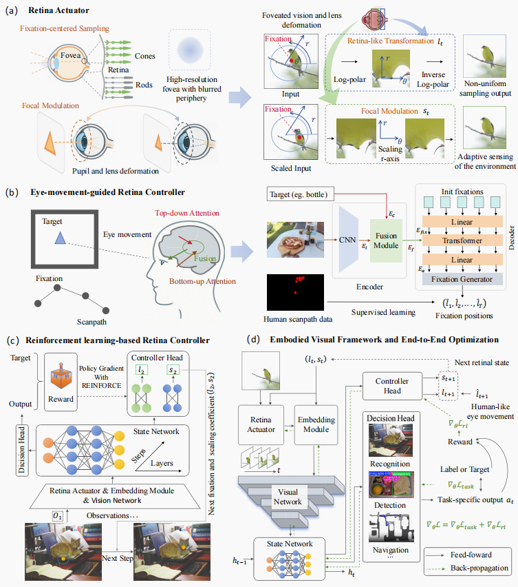
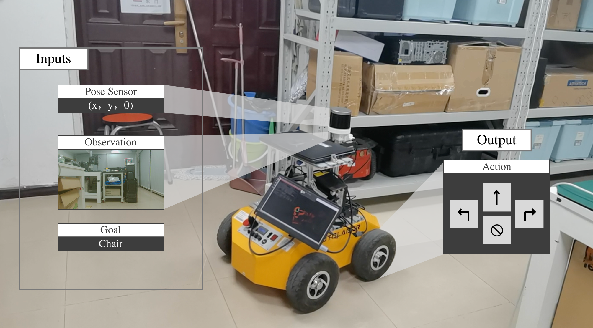

<div align="center">

# EV: Embodied Vision

### Embodied Vision for Closed-loop Perception-Decision Making in Intelligent Agents

**Manuscript under revision at Nature Communications**

[Project Website](https://ffionchen.github.io/EV.github.io/) | [ImageNet Code](EV-ImageNet/) | [Pretrained Weights](https://pan.baidu.com/s/16bm45WwHXMvL9zOWXXcxfQ?pwd=msuu)

</div>

## Overview

EV gives intelligent agents control over their visual input through an algorithmic eye. Fixation and focal modulation regulate retinal observations, connecting visual sensing, representation learning, and task decisions in a closed loop.

<p align="center">
  <a href="https://ffionchen.github.io/EV.github.io/">
    
  </a>
</p>

The [project website](https://ffionchen.github.io/EV.github.io/) presents the framework, experimental results, and videos of recognition, simulated navigation, and real-world deployment.

## Code and Release Status

| Experiment | Code | Status |
| --- | --- | --- |
| ImageNet recognition | [EV-ImageNet](EV-ImageNet/) | Available |
| Embodied navigation | Planned directory: `EV-Nav/` | Reproduction checks in progress |
| Retina visualization | Planned directory: `example/` | Being organized for release |
| Additional experiments | To be released | Being organized for release |

The shared `environment.yml` is being prepared for release. The sections below include the supplied experiment instructions and indicate where unreleased files are required.

## Pretrained Models

[Download pretrained weights](https://pan.baidu.com/s/16bm45WwHXMvL9zOWXXcxfQ?pwd=msuu) from Baidu Netdisk. Extraction code: **`msuu`**.

| Model file | Destination | Experiment |
| --- | --- | --- |
| `ev-resnet18-em4-224.tar` | `EV-ImageNet/weight/` | ImageNet, ResNet-18, EM=4 |
| `XGX-EV.pth` | `EV-Nav/models/` | Embodied navigation |
| `hm3d_rednet.pt` | `EV-Nav/models/` | Navigation semantic prediction |

## Experiment Instructions

[ImageNet](#2-imagenet-recognition) | [Retina Visualization](#1-retina-visualization) | [Navigation](#3-navigation)

## 1. Retina Visualization

<details>
<summary>Environment and visualization commands (release pending)</summary>

The following instructions apply once `environment.yml` and `example/` are released.

### Environment Setup

```bash
conda env create -f environment.yml
cd example
```

Modify the following parameters in `show_retina.py`:

- `l_t`: fixation location, in the range [-1, 1].
- `s_t`: focal modulation parameter.

Run the visualization:

```bash
python show_retina.py
```

</details>

## 2. ImageNet Recognition

<details open>
<summary>Setup and ResNet-18 evaluation</summary>

The shared environment setup follows Section 1 once `environment.yml` is released. The ImageNet dependency list is in [`EV-ImageNet/requirements.txt`](EV-ImageNet/requirements.txt).

Prepare the ImageNet-1K dataset and replace `/zjh/data/imagenet1-k` in the commands below with its local path.

### Pretrained Weights

Download `ev-resnet18-em4-224.tar` from [the pretrained model archive](https://pan.baidu.com/s/16bm45WwHXMvL9zOWXXcxfQ?pwd=msuu). Extraction code: `msuu`.

Place it in `EV-ImageNet/weight/`, then run all ImageNet commands from the project directory:

```bash
cd EV-ImageNet
```

### 2.1 Testing ResNet-18

```bash
CUDA_VISIBLE_DEVICES=0 python test_ev.py \
    --data-dir /zjh/data/imagenet1-k \
    -b 64 --epochs 1 --num-classes 1000 --img-size 224 \
    --model-kwargs patch_number=4 retina_size=224 use_residual=True \
    --model evc_resnet18 \
    --initial-checkpoint ./weight/ev-resnet18-em4-224.tar
```

</details>

<details>
<summary>Occlusion evaluation and training commands</summary>

### 2.2 Occlusion Results and Visualization

```bash
CUDA_VISIBLE_DEVICES=0 python test_ev_occ.py \
    --data-dir /zjh/data/imagenet1-k \
    --num-classes 1000 --img-size 224 \
    --model-kwargs patch_number=4 retina_size=224 \
    --model evc_resnet18 \
    --lr 1e-5 --opt adamw --opt-eps 1e-8 --weight-decay 0.05 \
    --warmup-epochs 2 --warmup-lr 1e-6 --min-lr 1e-7 \
    --epochs 1 --sched cosine -b 16 -j 1 --amp --dist-bn reduce \
    --initial-checkpoint ./weight/ev-resnet18-em4-224.tar
```

### 2.3 Training

The supplied training example uses two eye movements (`patch_number=2`); the evaluation checkpoint above uses four.

```bash
CUDA_VISIBLE_DEVICES=0,1 torchrun \
    --nproc_per_node=2 --master_port 29516 train_ev.py \
    --data-dir /zjh/data/imagenet1-k \
    --num-classes 1000 --img-size 224 \
    --model-kwargs patch_number=2 retina_size=224 use_residual=True \
    --model evc_resnet18 \
    --lr 1e-3 --opt adamw --opt-eps 1e-8 --weight-decay 0.0001 \
    --warmup-epochs 0 --warmup-lr 1e-6 --min-lr 1e-7 \
    --epochs 100 --sched cosine --aa rand-m9-mstd0.5-inc1 \
    -b 16 -j 8 --amp --dist-bn reduce --model-ema True \
    --mixup 0.2 --cutmix 1.0 --drop-path 0.2 --smoothing 0.1 \
    --save-eyemove-figs --eyemove-save-interval 10
```

</details>

## 3. Navigation

The navigation implementation will be released under `EV-Nav/` after reproduction checks are complete.

<p align="center">
  <a href="https://ffionchen.github.io/EV.github.io/">
    
  </a>
</p>

Simulation and real-world rollout videos are available on the [project website](https://ffionchen.github.io/EV.github.io/).

<details>
<summary>Navigation model preparation (code release pending)</summary>

### Pretrained Weights

Download `XGX-EV.pth` and `hm3d_rednet.pt` from [the pretrained model archive](https://pan.baidu.com/s/16bm45WwHXMvL9zOWXXcxfQ?pwd=msuu). Extraction code: `msuu`.

Place both files in `EV-Nav/models/`. Detailed environment, dataset, training, and evaluation instructions will be provided in `EV-Nav/README.md` when that directory is released.

</details>

## Acknowledgments

The ImageNet implementation is built on [PyTorch Image Models (timm)](https://github.com/huggingface/pytorch-image-models); the required source snapshot is included in `EV-ImageNet/timm`. The navigation implementation builds on [XGX](https://github.com/Jbwasse2/XGX) and [Habitat](https://github.com/facebookresearch/habitat-lab).

Figures shown in this README are taken from the [EV project website](https://ffionchen.github.io/EV.github.io/).
